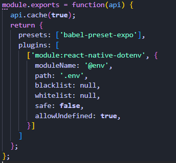

# Uso de Ngrok para demostrar su aplicación móvil

Autores: Esteban Garcia, Gabriel Bergoeing, y Matías Hrdina

Ngrok es una herramienta que te permite exponer localmente aplicaciones web en tu máquina a Internet. Funciona creando un túnel entre un puerto local (por ejemplo, donde está corriendo tu servidor de desarrollo) y un dominio público accesible desde cualquier parte de Internet. Es especialmente útil para pruebas rápidas, demostraciones y desarrollo local cuando necesitas que otros interactúen con tu aplicación sin que esté desplegada en un servidor público.

1. Crear una cuenta en Ngrok

Antes de comenzar, debes crear una cuenta en [Ngrok](https://ngrok.com/). Luego, sigue las instrucciones de la página web para instalar Ngrok en tu sistema.

Importante: Copia los comandos desde la página de Ngrok, ya que el segundo comando contiene el authtoken de tu cuenta registrada.

2. Cambios en el código del proyecto

En el archivo `backend/config/environments/development.rb` se debe permitir la comunicación con Ngrok añadiendo lo siguiente:

```ruby
# Allow Ngrok communications

config.hosts << /[a-z0-9-]+\.ngrok-free\.app/
```

En el archivo hybrid-frontend/app.json:
Agrega la sección de plugins como se muestra en la imagen:


3. Instalar librería npm

En tu proyecto, instala la librería react-native-dotenv con el siguiente comando:
`npm install react-native-dotenv`

4. Usar Ngrok

Abre una terminal adicional (aparte de la que ya utilizas para el frontend híbrido y el backend). Esta terminal no necesita estar en un directorio específico.

Ejecuta el siguiente comando en esa terminal:

`ngrok http 3001`

la terminal se debe ver asi despues de hacer el comando


en la linea de fowarding hay un link, este link va cambiando cada vez que se ejecuta el comando
en este caso me toco  https://31fc-190-100-240-174.ngrok-free.app

5. Configuración del archivo .env

Ahora vamos a crear un .env en hybrid frontend con la siguiente estructura
`NGROK_URL = https://31fc-190-100-240-174.ngrok-free.app`
Importante: En la línea de "Forwarding" que aparece en la terminal, Ngrok genera un enlace único que cambia cada vez que se ejecuta el comando ngrok http 3001. Asegúrate de actualizar este enlace en el archivo .env cada vez que reinicies Ngrok, ya que el valor del enlace varía con cada nueva sesión.

6. Actualizar babel.config.js

En el archivo hybrid-frontend/babel.config.js, agrega la siguiente sección de plugins:
  
Toda la parte de plugins es nueva y se necesita para manejar las variables de entorno.
7. Hacer llamados al backend con Ngrok
Importa la URL de Ngrok al inicio de tus archivos de código utilizando:

`import { NGROK_URL } from '@env';`

Así es como debería verse un ejemplo de llamado al backend usando Ngrok:

